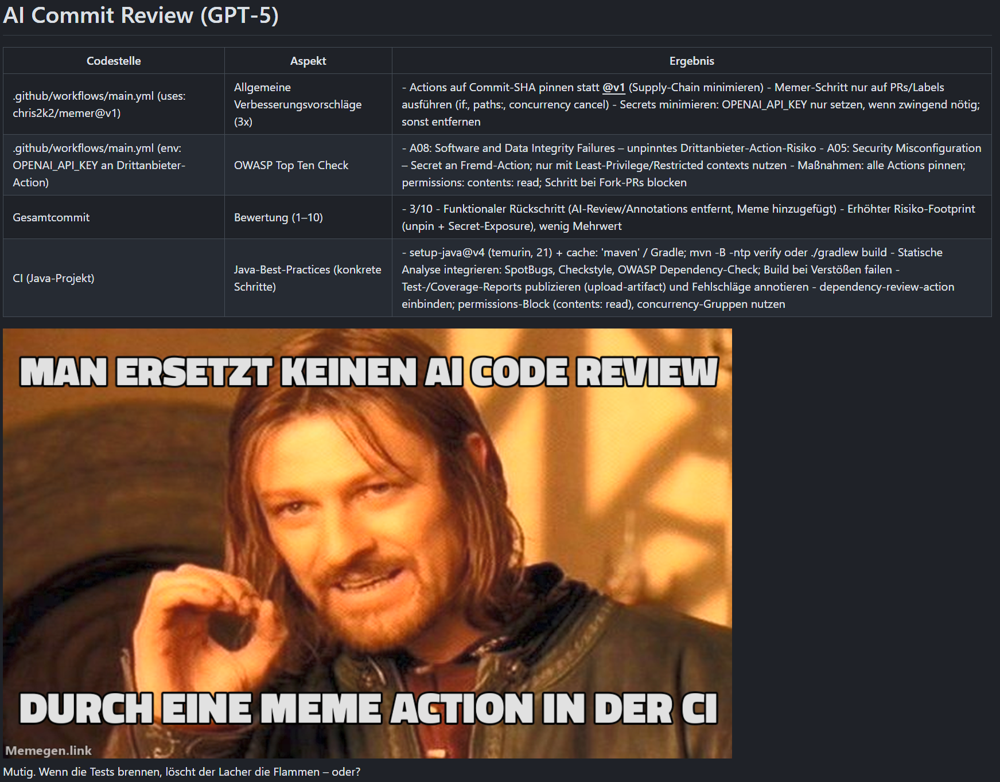

# Memer

Looks at your commit and roasts it via a Meme. Since it is also helpful it adds some information why you deserve this.

It internally uses OpenAI, so you have to have an API key.



## Usage

Basically you only need to checkout with ``fetch-depth: 0`` and call it

```yaml
- uses: actions/checkout@v4
  with:
    fetch-depth: 0 
- uses: chris2k2/memer@v1
  env:
  OPENAI_API_KEY: ${{ secrets.OPENAI_API_KEY }}
```
